# Amaterasu's Brush: Interactive Nature Restoration

**Unity · Technical Art · Houdini · Procedural Rendering**

New Celestial Brush commands, Houdini-authored plant growth, a procedural vegetation trail, ink-style ground shadows, and failed-stroke feedback built in Unity.

[View the full project page](https://r-murdock.com/amaterasus-brush)

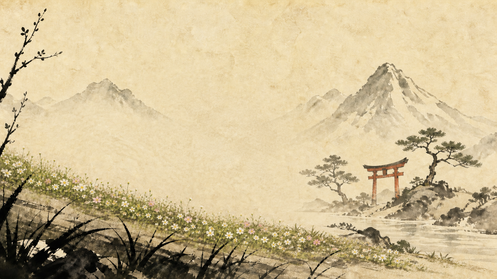

## Project overview

Amaterasu's Brush is a Unity technical-art project built around gesture-driven world effects. It begins with [Mix and Jam's Celestial Brush prototype](https://github.com/mixandjam/Okami-Celestial-Brush), which supplies the gesture recognizer, brush interface, bomb and tree interactions, and Toon Shader.

This project adds sun, moon, and plant commands; day and night responses; Houdini plant growth; a replacement wolf character; a procedural grass-and-flower trail; ink-style ground shadows; and ordered failed-stroke feedback.

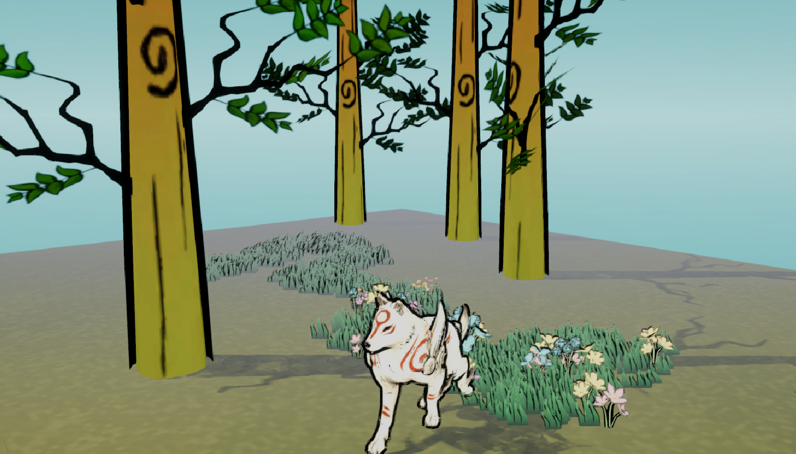

### Contributions at a glance

- Recorded and integrated new sun, moon, and plant gesture templates
- Connected gesture results to sky transitions, celestial effects, and plant growth
- Built a Houdini growth animation and integrated its Alembic playback in Unity
- Replaced and retuned the player character, collider, camera follow, and walk state
- Adapted an indirect-instanced grass renderer into a path-driven vegetation trail
- Added flower growth, retreating vegetation, and petal release along the trail
- Developed a watercolor ground shader using the directional-light shadow map
- Added ordered stroke dissolution and directionally drifting ink fragments for failed input

## Project showcase

### 01 · Brush commands

New gesture templates were recorded for the sun, moon, and plant. Recognition results are routed to the corresponding visual effects, day/night transitions, and plant-growth trigger while retaining the original recognizer as the input framework.

| Sun command | Moon command |
| --- | --- |
| 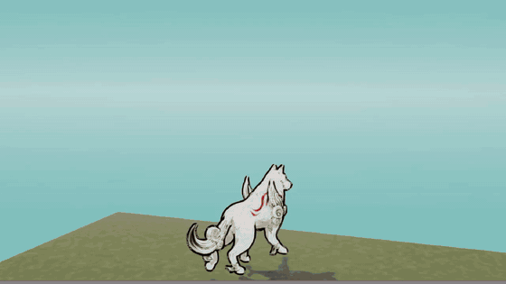 | 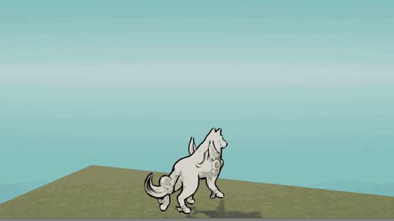 |

### 02 · Houdini plant growth

The plant mesh and its curl-to-unfold growth animation were built in Houdini, exported as Alembic, and connected to the plant command for playback in Unity.

| Houdini growth animation | Unity gameplay integration |
| --- | --- |
| 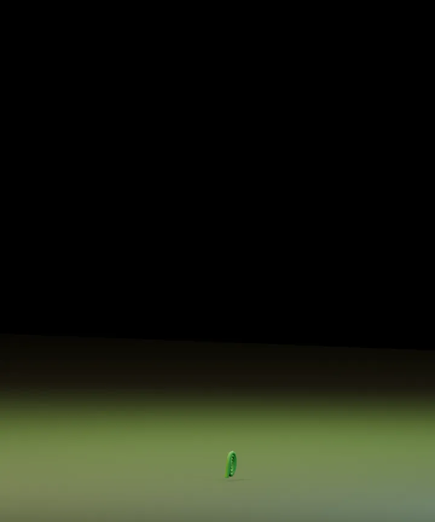 | 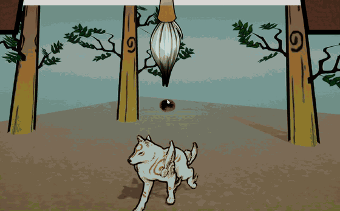 |

### 03 · Character integration

A rigged quadruped asset was connected to the player controller and walk state. Scale, ground offset, collider bounds, and camera follow were corrected in Unity, then the supplied Toon Shader and outline were configured to match the scene.

| Rigged character | Walk integration |
| --- | --- |
| 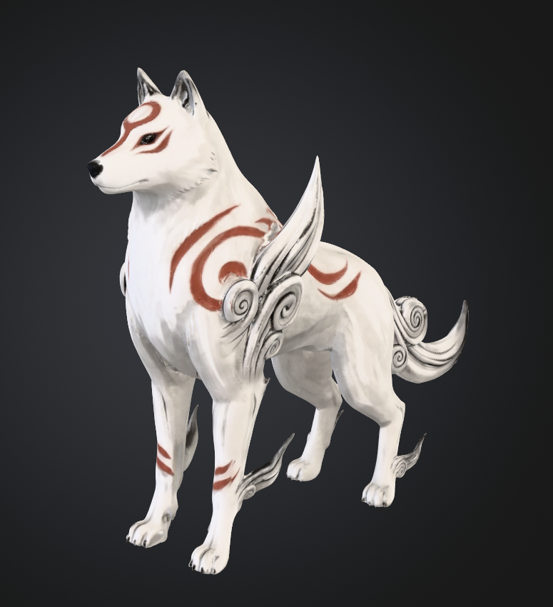 | 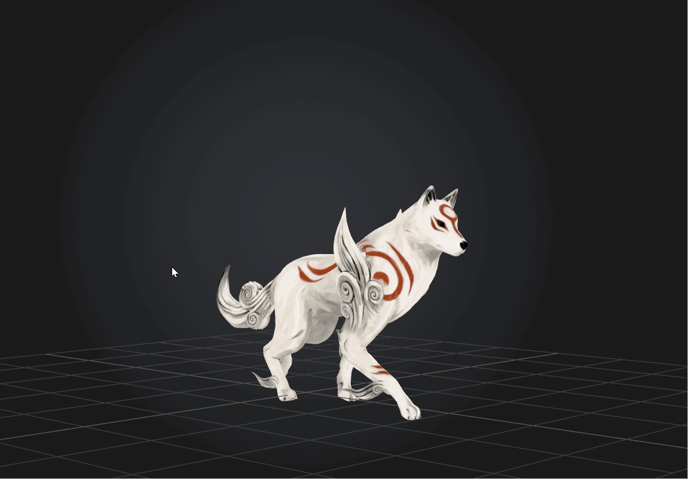 |

### 04 · Procedural vegetation trail

The trail adapts NiloCat's indirect grass-rendering example and Quaternius's CC0 flower mesh. A custom emitter samples the wolf's path, controls grass and flower density, grows instances from below the terrain, returns them into the ground, and releases petals as the trail clears.

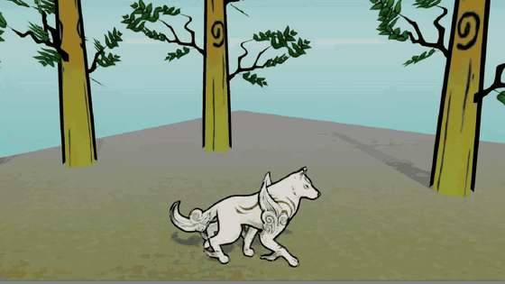

### 05 · Ink-style ground shadows

The ground shader samples the directional-light shadow map and reshapes it with a softer boundary, paper breakup, and controlled dry-brush gaps. Cascade blending was corrected so the shadow remains continuous as the camera moves.

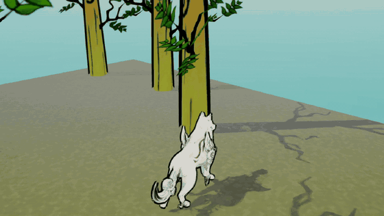

### 06 · Failed-stroke feedback

When recognition fails, the drawn stroke remains visible and dissolves in drawing order. A separate particle layer follows the same direction and drifts away with independent timing.

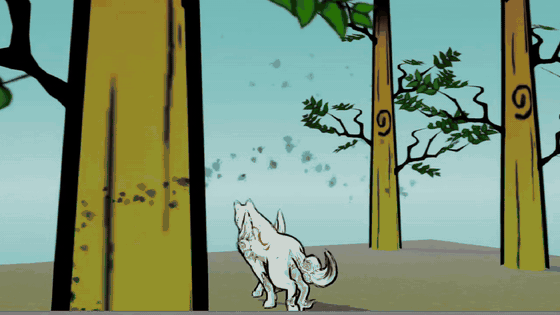

## Technical stack

- Unity 2019.4 and C# gameplay/editor scripting
- Universal Render Pipeline, ShaderLab, and HLSL
- Houdini procedural modeling and Alembic animation exchange
- GPU indirect instancing for trail vegetation
- Custom gesture templates, coroutine-driven sequencing, and particle systems

The sections below preserve the original CIS 566 design document and its detailed implementation notes.

---

## CIS 566 Final Project Design Document

Muqiao Lei

---

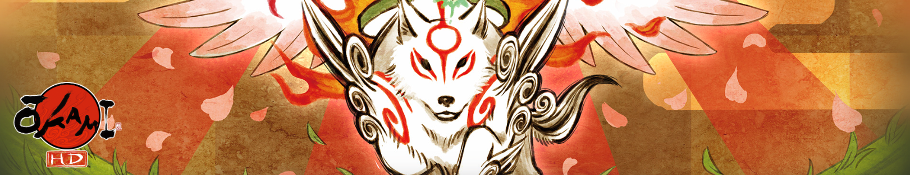

---

## Quick Start

### Requirements

- Unity `2019.4.3f1`
- Windows Build Support (Mono) for creating a Windows build

This portfolio repository intentionally contains the gameplay, editor, and
shader source without the project's large Alembic, Houdini, character,
third-party, and generated assets. Restore those locally owned production
assets before opening the complete showcase scene.

Open `Assets/Scenes/MixAndJAm.unity` and press Play.

### Controls

| Input | Action |
| --- | --- |
| `W`, `A`, `S`, `D` | Move the character |
| Hold `C` | Enter Celestial Brush mode |
| Left mouse button | Draw while Brush mode is active |
| Release `C` | Recognize the gesture and trigger its effect |
| `R` | Reload the current scene |
| `D` / `N` | Debug shortcuts for day/night |

Available gestures include sun/circle, moon, plant and horizontal line. The main
scene also retains the original bomb and tree-cutting interactions from the Mix
and Jam prototype.

### Building

The checked-in standalone configuration uses the Mono scripting backend so the
project can be built with the standard Windows Build Support module. The only
enabled build scene is `Assets/Scenes/MixAndJAm.unity`.

---

## Introduction

This project extends the Mix and Jam Celestial Brush project with nature
restoration effects, procedural growth animation, day/night control, ink-style
rendering, and additional character/environment systems built around the
original gesture-recognition foundation.

Houdini-authored tree blooming and grass-growth animations are integrated into
Unity so recognized gestures can trigger the effects, alongside a day/night
transition system.

---

#### Goal

The project extends the existing Mix and Jam Celestial Brush prototype with the
following features:

1. **Day/Night Control** - Draw sun/moon to transition sky colors and lighting
2. **Plant Growth** - Draw plant gesture to spawn growing vegetation with Houdini animations
3. **Visual Effects Enhancement** - Add ink particle effects and celestial object animations

---

## Inspirations and References

**Primary Reference - Mix and Jam Celestial Brush:**

- GitHub: https://github.com/mixandjam/Okami-Celestial-Brush
- Video: https://www.youtube.com/watch?v=yuQXeaYBuuM
- **Usage**: Foundation for gesture recognition and input handling

**Original Game - Okami:**

- Bloom technique: reviving dead trees
- Sunrise technique: controlling day/night

**Houdini Technical References:**

- L-system for plant generation
- Animation and growth effects

---

## Specifications

###### Core Features:

**1. Day/Night System**

- Recognize sun/moon gestures
- Sky color transitions
- Lighting changes

**2. Plant Growth System**

- Detect plant gesture on ground
- Spawn plants with growth animations
- Alembic-based procedural animation from Houdini

---

#### Techniques

### Workflow:

**Houdini:**

- Create plant models with branches and leaves
- Create curl-to-unfold growth animations
- Export as Alembic format to Unity

**Unity:**

- Import Houdini Alembic assets
- Connect gesture recognition to effect triggers
- Handle day/night lighting changes
- Implement ink particle conversion system

## Design

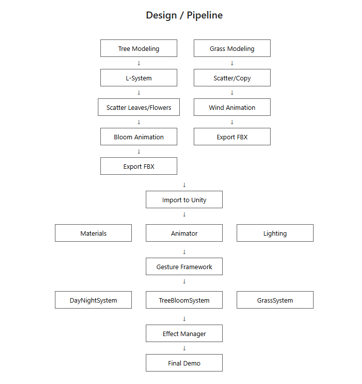

**Workflow:**

Houdini Production:

- Tree modeling → L-System → Scatter leaves/flowers → Bloom animation → Export FBX
- Grass modeling → Scatter/Copy → Wind animation → Export FBX

Unity Integration:

- Import assets → Setup materials/animation/lighting
- Connect to gesture framework
- Implement three systems: DayNightSystem, TreeBloomSystem, GrassSystem
- Effect Manager for unified control
- Final Demo

---

## Implemented Feature

### 1. Day/Night System

**Implementation Details:**

- **SkyboxController Script**: Controls smooth transitions between day and night skyboxes

- **Key Features:**
  
  - Uses two separate skybox materials (day/night)
  - Smooth interpolation of the following properties:
    - Sun disc color (`_SunDiscColor`)
    - Sun halo color (`_SunHaloColor`)
    - Horizon line color (`_HorizonLineColor`)
    - Sky gradient colors (top and bottom)
  - Dynamic directional light intensity adjustment (dims to 0.1 at night, restores to maximum during day)
  - Real-time global illumination updates (`DynamicGI.UpdateEnvironment()`)

- **Control Methods:**
  
  - Press `D` key: Switch to day
  - Press `N` key: Switch to night
  - Customizable transition speed parameter

- **Technical Implementation:**
  
  - Uses material instances to avoid modifying original assets
  - Lerp interpolation for smooth transition effects
  - Memory management: Cleans up material instances in `OnDestroy`

---

### 2. Ink Particle Effects System

**Implementation Details:**

- **InkToParticles Script**: Converts brush strokes into particle effects inspired by Okami
- **ParticleFadeOut Script**: Handles individual particle fade-out and animation behavior

**Key Features:**

- **Brush Stroke to Particle Conversion:**
  
  - Samples points along LineRenderer path based on configurable density (`particlesPerUnit`)
  - Gradually converts ink strokes into particles with staggered timing
  - Validates all position data to prevent NaN errors

- **Particle Behavior:**
  
  - Random positioning offset for natural spread effect
  - Camera-facing orientation with random rotation
  - Random scale variation (0.3-0.8x) for visual variety
  - Customizable particle color (default: orange `Color(1f, 0.5f, 0f)`)

- **Animation System:**
  
  - **Two-phase animation:**
    1. Particle generation phase (0.4s): Particles spawn progressively along stroke
    2. Line fade-out phase (1.0s): Original line gradually disappears from end to start
  - **Particle fade-out effects:**
    - Alpha fade over customizable duration
    - Scale reduction animation
    - Continuous rotation (100-300 degrees/second)
    - Staggered fade delays for cascading effect

- **Technical Implementation:**
  
  - Uses coroutines for smooth gradual conversion
  - Material instancing to avoid asset modification
  - Custom render queue ordering (particles at 3100, line at 2000)
  - Proper transparency blending setup (SrcAlpha/OneMinusSrcAlpha)
  - Memory management: Automatic cleanup of line and particles after animation

- **Visual Polish:**
  
  - Particles positioned slightly toward camera for depth
  - Line gradually reveals while particles are generated
  - Smooth transition from ink stroke to floating particles

---

### 3. Celestial Object System (Sun/Moon)

**Implementation Details:**

- **SunAmaterasu Script**: Generates and controls sun effects with day/night transition
- **MoonAmaterasu Script**: Generates and controls moon effects with day/night transition
- **TextureGenerator Script**: Procedurally generates Okami-style sun ray textures

**Sun System Features:**

- **Multi-layer Visual Effects:**
  
  - Sun disc layer
  - Sun rays layer with 12 rotating beams
  - Uses Okami's signature vermillion color (`Color(1f, 0.25f, 0.1f)`)

- **Animation Sequence:**
  
  1. Sun disc fades in (1 second)
  2. White flash screen effect
  3. Triggers sky transition to day
  4. Rays layer fades in (0.5 seconds)
  5. Rays continuously rotate (30 degrees/second)
  6. Displays for 2.5 seconds before disappearing
  7. Disappearance animation: Rays fade out first, disc fades out after 0.2 second delay

- **Screen Flash Effect:**
  
  - Creates fullscreen white canvas overlay
  - Fades from fully opaque to transparent (0.5 seconds)
  - Uses DOTween for smooth transitions
  - Automatic cleanup after animation

**Moon System Features:**

- **Minimalist Design:**
  
  - Single moon object layer
  - Quick fade-in animation (0.2 seconds)
  - Triggers sky transition to night
  - Brief display before fading out (configurable `displayTime`)

- **Animation Sequence:**
  
  1. Moon quickly fades in
  2. Triggers sky transition to night
  3. Displays for set duration (default 0.5 seconds)
  4. Fades out and destroys (1 second)

**Procedural Texture Generation:**

- **TextureGenerator Editor Tool:**
  - Adds "Tools/Generate Okami Sun" button to Unity menu
  - Generates 512x512 resolution texture
  - Procedurally creates 12-beam ray pattern
  - Uses trigonometric functions (`Cos(angle * 12)`) for evenly distributed beams
  - Cel-shading style with sharp edges
  - Hollow center design (leaves space for sun disc)
  - Auto-saves as PNG file to Assets directory

**Technical Implementation:**

- Uses DOTween plugin for smooth fade animations
- Coroutines control complex animation sequences
- Dynamic material alpha channel for transparency control
- Integration with SkyboxController for global day/night transitions
- Memory management: Automatic object destruction after animation completion

---

### 4. Plant Growth Animation System

**Implementation Details:**

- **PlantAnimationPlayer Script**: Controls Alembic animation playback and object lifecycle
- **Houdini Asset Workflow**: Creates procedural plant growth animations
  
  The production Alembic cache is intentionally kept out of this source-only
  repository because of its size.

**Houdini Production Pipeline:**

- **Plant Modeling:**
  
  - Plants separated into two components: branches and leaves
  - Individual curl-to-unfold growth animations for each component
  - Exported as Alembic (.abc) format files

- **Animation Design:**
  
  - Curled state as starting frame
  - Gradual unfurling to fully expanded state
  - Maintains natural, fluid motion

**Unity Integration:**

- **Asset Import:**
  
  - Import Alembic files into Unity
  - Uses Unity's Alembic Importer package
  - Configured as Prefabs for reusability

- **Animation Playback Control:**
  
  - Uses `AlembicStreamPlayer` component
  - Starts playback from timeline origin (`CurrentTime = 0`)
  - Real-time animation time updates for full sequence playback

**Animation Sequence:**

1. **Growth Phase:**
   
   - Plays complete Alembic animation sequence
   - Animation duration determined by imported Alembic file
   - Uses coroutines for frame-by-frame time updates

2. **Display Phase:**
   
   - Holds for 3 seconds after animation completes
   - Showcases fully expanded plant state

3. **Disappearance Phase:**
   
   - Shrink animation (2 seconds)
   - Uses `Vector3.Lerp` for smooth scale interpolation
   - Scales from original size to zero
   - Automatic object destruction upon completion

**Technical Implementation:**

- Coroutines manage complex multi-stage animation sequences
- Dynamic time control enables Alembic animation playback
- Smooth scale interpolation prevents abrupt disappearance
- Configurable shrink animation duration (`shrinkDuration`)
- Automatic memory management and object cleanup

---

### 5. Gesture Recognition and Integration System

**Implementation Details:**

- **Demo Script**: Core gesture recognition and effect trigger manager
- **Based on PDollar Gesture Recognizer**: Uses point cloud recognition algorithm for gesture matching

**Gesture Recognition Features:**

- **Supported Gesture Types:**
  
  - **Sun Gesture (Sun/Cherrybomb)**: Circular gesture - Triggers sun generation and day transition
  - **Moon Gesture (Moon)**: Crescent shape - Triggers moon generation and night transition
  - **Plant Gesture (Plant)**: Custom gesture - Generates plants on ground
  - **Line Gesture (Horizontal Line/Line)**: Horizontal slash - Cuts trees (original feature)
  - **Bomb Gesture (Cherrybomb)**: Circular gesture on objects - Generates explosion effect (original feature)

- **Gesture Drawing System:**
  
  - Real-time LineRenderer tracking mouse/touch input
  - Multi-touch and multi-stroke support
  - Dynamic vertex count and position updates
  - Cross-platform support (PC, Android, iOS)

**Sun Gesture Effects:**

- **Trigger Conditions:**
  
  - Recognizes "cherrybomb" or "sun" gesture
  - No collision at gesture center (drawn in open space)
  - Recognition confidence threshold > 0.75

- **Effect Sequence:**
  
  1. Ink stroke converts to orange particle effects
  2. Sun spawns 20 units behind gesture center
  3. Sun faces camera
  4. Triggers SkyboxController to switch to day
  5. Cleans up strokes and resets recognition state

**Moon Gesture Effects:**

- **Trigger Conditions:**
  
  - Recognizes "moon" gesture
  - No collision at gesture center
  - Recognition confidence threshold > 0.75

- **Effect Sequence:**
  
  1. Ink stroke converts to blue particle effects (`Color(0.5f, 0.5f, 1f)`)
  2. Moon spawns 20 units behind gesture center
  3. Moon faces camera
  4. Triggers SkyboxController to switch to night
  5. Cleans up strokes and resets recognition state

**Plant Gesture Effects:**

- **Trigger Conditions:**
  
  - Recognizes "plant" gesture
  - Raycast from stroke start point detects ground
  - Recognition confidence threshold > 0.75

- **Effect Sequence:**
  
  1. Plant spawns at raycast hit point (slightly lowered by 0.2 units)
  2. Automatically plays Alembic growth animation
  3. Cleans up strokes and resets recognition state

**Bomb Gesture Effects (Original Feature):**

- **Trigger Conditions:**
  
  - Recognizes "cherrybomb" or "sun" gesture
  - Collision detected at gesture center (drawn on objects)
  - Recognition confidence threshold > 0.75

- **Effect Sequence:**
  
  1. Sphere explosion spawns at gesture center
  2. Triggers camera shake effect
  3. Sphere features elastic scale animation (DOTween OutBack)
  4. Cleans up strokes and resets recognition state

**Gesture Recognition Technology:**

- **PDollar Point Cloud Recognition Algorithm:**
  
  - Converts drawn strokes into point collections
  - Matches against pre-trained gesture set
  - Returns best match gesture and confidence score
  - Recognition below 0.75 confidence is ignored

- **Training Set Management:**
  
  - Pre-loads built-in gesture set (Resources/GestureSet/)
  - Supports user-defined custom gestures
  - Dynamically adds new gestures to training set
  - Gesture data stored in XML format

**Ink Particle Integration:**

- Sun gesture uses orange particles (default color)
- Moon gesture uses light blue particles
- Particle density: 3 particles per unit
- Fade duration: 0.7 seconds
- Automatic line object cleanup after conversion

**Collision Detection and Spatial Positioning:**

- **Raycast System:**
  
  - Casts ray from gesture center toward camera forward direction
  - Detects if scene objects are hit
  - Sun/moon require open space to trigger
  - Plants require ground hit to spawn
  - Bombs require object hit to trigger

- **Camera Space Calculations:**
  
  - Celestial objects placed at appropriate position in camera view
  - 20 units away from gesture center (away from camera direction)
  - Always face camera to maintain front visibility
